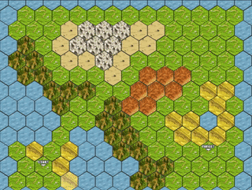

# A* Pathfinding Visualization

An interactive visualization of the A* pathfinding algorithm in action. It features a hexagonal tile grid with various types of terrain to observe how the shortest route between two points changes.

## Instructions

TODO: ...

##  To Dos

- [x] Make it into a web component for ease of use.
- [x] Publish as an https://www.npmjs.com/package/@d10f/a-star-viz[NPM package].
- [x] Add bundler to include make all web component self-contained.
- [ ] Customize terrain tiles.
- [ ] Better support for various screen sizes.
- [ ] Better customization options through attributes passed in at runtime.
